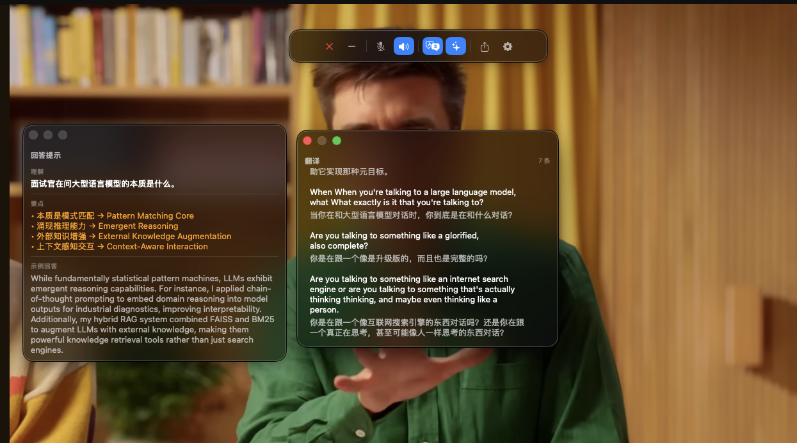
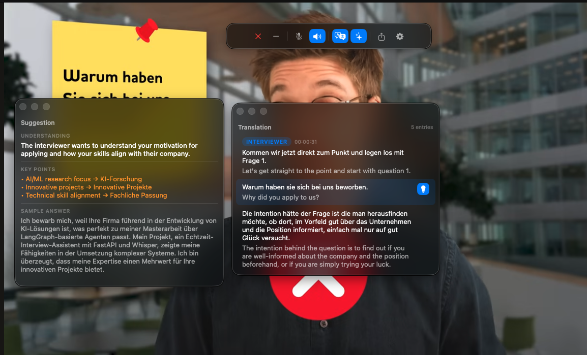

# MIMI 面试助手

中文 · [English](README.md)

为中文母语者准备的实时英文/德文面试助手。原生 macOS app，捕获系统音频 + 麦克风，用流式 Whisper 实时转写，同步翻译成母语，可选用 RAG 生成答题提示。

字幕 + 翻译悬浮窗**可以盖在 macOS 任何应用上面** —— Zoom / Teams / Meet / Webex 各种视频会议、网课、播客、YouTube 视频都行。只要声音从扬声器出来，MIMI 就能听并翻。

| 英语面试 + 中文字幕/答题 | 德语面试 + 英文字幕/答题 |
|---|---|
|  |  |

> 截图测试用的是浏览器里播 [一段 YouTube 模拟面试视频](https://www.youtube.com/results?search_query=mock+interview)。换成真实 Zoom 通话流程一样。

## 默认本地，保护隐私

MIMI 自带 **Whisper**（语音识别）和 **Ollama + Qwen3-4B**（翻译/答题建议），两者都**完全在你的 Mac 本机运行**。默认配置下音频、字幕、上传的简历内容**不会离开本机** —— 没有埋点、没有遥测、没有上传服务器。面试场景下的对话保密性可控。

如果你想用云端 LLM（Gemini / Claude / OpenAI）换更高的翻译质量，只有翻译用的 prompt 会发到该提供商；API key 存在 **macOS Keychain**，明文不落盘、不上传任何地方。

## 功能

- **双路转写** — ScreenCaptureKit 抓系统音频（面试官），AVAudioEngine 抓麦克风（你自己），互不干扰
- **流式字幕** — 用 LocalAgreement-2 算法，字逐渐出现，约 2 秒延迟
- **实时翻译** — 流式 token 推送（面试语言 → 母语），不等整句出完
- **AI 答题建议** — 三层触发（本地过滤 → 意图 LLM → RAG）自动识别真问题、跳过寒暄；也可点击字幕手动触发
- **双语答案输出** — 三段式：📌 问题理解（母语） + 💡 要点（双语对照） + 🗣️ 示例回答（面试语言，STAR 风格带数字）
- **运行时控制** — 悬浮控制条（开关麦/屏幕录制）+ 菜单栏图标 + Cmd+, Settings 切语言/AI 提示开关
- **悬浮字幕窗** — 透明置顶，盖在任何视频会议 app 上
- **回声消除** — 用 Apple 原生 `VoiceProcessingIO` AEC，扬声器播出的面试官声音从麦克风轨道中消除；不戴耳机也行，**不需要装虚拟声卡驱动**

## 架构

```
Swift App (SwiftUI) ──WebSocket (binary PCM + JSON)──→ Python Backend (FastAPI)
│                                                              │
├─ ScreenCaptureKit (系统音频, prefix 0x00)            ┌────────┴────────┐
├─ AVAudioEngine  (麦克风,   prefix 0x01)              │                 │
├─ NSPanel (悬浮字幕窗，自动 level 切换)               ▼                 ▼
└─ Settings (Cmd+,)                            AudioSource          AudioSource
                                              （面试官）            （你自己）
                                              ├─ StreamingSTT      ├─ StreamingSTT
                                              ├─ SentenceSegmenter ├─ SentenceSegmenter
                                              └─ partial_id        └─ partial_id
                                                         ↓                ↓
                                                      SharedHistory（共享）
                                                      │
                                                      ├──→ translator（流式翻译）
                                                      │
                                                      └──→ RAG 答题 pipeline:
                                                            [A] question_filter
                                                            [B] intent_classifier（LLM 闸门）
                                                            [C] rag/engine.py
                                                            manual 路径绕过 A/B
```

**前端**: SwiftUI 原生 macOS app。每秒抓系统音频 + 麦克风（各加 1 字节 source 前缀），WebSocket 推到后端，渲染流式字幕（partial / final 双态）。`NSPanel` 悬浮窗在 Settings 等其它窗口拿到 key focus 时自动从 `.floating` 降到 `.normal`（避免遮挡）。

**后端**: Python FastAPI + WebSocket。每路音频独立协程跑 `AudioSource` pipeline：音频块进累积缓冲 → mlx-whisper（Metal GPU）跑整个缓冲 → LocalAgreement-2 抽稳定词 → 按 speaker 独立分句 → 进共享历史 → 流式翻译 → 可选 RAG。

**答题触发三层**（手动点击都跳过这三层）：

| 层 | 成本 | 过滤掉的 |
|---|---|---|
| `conversation/question_filter.py` | O(1) 本地 | 长度 < 3 词 / 纯标点 / 双语寒暄黑名单（"OK"、"Got it"、"Ja" ...） |
| `conversation/intent_classifier.py` | ~300ms Gemini flash | 语义非问句（"So our team uses Python"、"Let me think"） |
| `rag/engine.py` | ~2s LLM + ChromaDB | 检索个人资料 + 双语三段答案 |

手动模式：点击面试官字幕行 → 💡 按钮出现 → 点击对该句直接跑 RAG（带前 5 句 context）。手动永远抢占自动跑中任务。

## 技术栈

| 层 | 实现 |
|---|---|
| 音频抓取 | ScreenCaptureKit + AVAudioEngine |
| 回声消除 | Apple `VoiceProcessingIO`（硬件 AEC + 降噪 + AGC，零依赖） |
| 音频流水线 | AudioSource（每路：StreamingSTT + SentenceSegmenter） |
| 语音识别 | mlx-whisper fp16（Apple Silicon Metal GPU + ANE） |
| 流式 STT | LocalAgreement-2（连续推理求 LCP） |
| 对话状态 | SharedHistory（共享） + SentenceSegmenter（每路） |
| 翻译 | LangChain LCEL → Ollama Qwen3-4B-Instruct-2507（默认）/ Gemini Flash / Claude Sonnet / OpenAI GPT-5-mini，流式 |
| RAG | LangChain + ChromaDB + all-MiniLM-L6-v2 embedding |
| 意图闸门 | Gemini flash yes/no 二分类 |
| 前端 | SwiftUI + NSPanel 悬浮 + Settings scene |
| 通信 | WebSocket（二进制音频 + JSON 控制消息） |

## 系统要求

- macOS 14+（推荐 15 / 26 Sequoia / Tahoe），Apple Silicon (M1 / M2 / M3 / M4)
- Python 3.11+（conda 推荐）
- Xcode 16+
- **任选一个** LLM 后端：
  - **本地（默认推荐）** — Ollama daemon + Qwen3-4B-Instruct-2507（零费用、离线可用、Apache 2.0）
  - 或云端 — Gemini / Claude / OpenAI API key

## 安装（普通用户）

### 选 1：DMG 双击装（推荐，零命令行）

1. 去 [Releases](https://github.com/marlonxie/MIMI/releases/latest) 下最新的 `MIMI-*.dmg`
2. 双击 `.dmg` 挂载
3. 拖 **MIMI** 图标到 **Applications** 快捷方式
4. **首次启动**：右键 `/Applications/MIMI.app` → 「打开」→ 弹窗里再点「打开」（一次性绕 Gatekeeper；正式 Developer ID 公证在 roadmap）
5. Splash 加载页显示模型下载进度（~3 GB：Qwen3 + Whisper），首次启动约 10-20 分钟
6. 系统弹权限请求时授予麦克风 + 屏幕录制

backend、Ollama daemon、Whisper 全部 bundled 进 app，**不需要装任何外部依赖**。

### 选 2：Homebrew（适合开发者）

```bash
brew tap marlonxie/mimi
brew install --cask mimi
open -a MIMI
```

## 卸载

1. 退出 MIMI（菜单栏 → 退出）
2. 把 `/Applications/MIMI.app` 拖废纸篓
3. **可选** — 清掉 ~3.5 GB 的模型缓存和上传过的资料：
   ```bash
   # MIMI 自己的数据（Qwen3 模型、ChromaDB、上传资料、对话记录）
   rm -rf ~/Library/Application\ Support/MIMI
   # 只删 MIMI 用的 HF 模型 — 保留你其他 HF 项目的缓存
   rm -rf ~/.cache/huggingface/hub/models--mlx-community--whisper-small-mlx
   rm -rf ~/.cache/huggingface/hub/models--sentence-transformers--all-MiniLM-L6-v2
   rm -rf ~/Library/Logs/MIMI
   rm -f  ~/Library/Preferences/com.marlon.MimiApp.plist
   defaults delete com.marlon.MimiApp 2>/dev/null
   ```
4. **或者** 拖 MIMI.app 给 [AppCleaner](https://freemacsoft.net/appcleaner/)（免费 GUI）—— 自动识别相关文件（不会扫 HF cache，要清的话手动跑上面的命令）

API keys 在 macOS Keychain，要清的话开 Keychain Access 搜 "MIMI" 删。

---

## 从源码开发

```bash
# 1. clone
git clone https://github.com/marlonxie/MIMI.git
cd MIMI

# 2. Python 环境
conda create -n mimi python=3.11
conda activate mimi
pip install -r mimi-backend/requirements.txt
```

### LLM 后端（任选其一）

**选 A — 本地 Ollama（默认，不需要 key）**

```bash
brew install ollama
brew services start ollama
ollama pull qwen3:4b-instruct-2507-q4_K_M
```

跳过下面的 `.env` 步骤。MIMI 检测到"没 key"就自动 fallback 到本地 Ollama。TTFT ~100ms，对比 Gemini ~1500ms（含网络 RTT）。

**选 B — 云端（Gemini / Claude / OpenAI）**

```bash
cp mimi-backend/.env.example mimi-backend/.env
# 编辑 .env 填 GOOGLE_API_KEY / ANTHROPIC_API_KEY / OPENAI_API_KEY 其中之一
```

或者跳过 `.env`，运行时在 Settings UI (Cmd+,) 里填 key —— 会存到 macOS Keychain。

### 后续步骤

```bash
# 3. 启 backend
cd mimi-backend && python server.py
# WebSocket 听 ws://127.0.0.1:8765

# 4. Xcode 编 + 跑前端
open ../mimi-app/MimiApp.xcodeproj
# 系统弹权限请求时授麦克风 + 屏幕录制
```

### （可选）上传参考资料给 AI 答题

在运行的 app 里：点 Hub 上传按钮（或开 Settings → 参考资料 tab）选你的简历 / 项目笔记（`.pdf` / `.md` / `.txt`）。后端自动重建索引；后续答题建议会引用这些文件。

Settings → 参考资料 tab 也能管已上传的文件（单删 / 全删）。

CLI 替代（高级用法，例如批量索引）：把文件丢到 `~/Library/Application Support/MIMI/resources/` 然后跑 `cd mimi-backend && python -m rag.indexer`。

### 数据存哪

所有用户数据都在 `~/Library/Application Support/MIMI/`：

```
~/Library/Application Support/MIMI/
├── resources/        ← 上传的 PDF / Markdown / 文本
├── chroma_store/     ← RAG 向量索引（从 resources/ 重建）
├── ollama-models/    ← Qwen3-4B-Instruct（~2.6GB，首次启动下）
└── transcripts/      ← 默认对话导出位置（UI 导出可选位置）
```

Whisper 模型 (~500MB) + sentence-transformer embedding (~90MB) 在 `~/.cache/huggingface/hub/`（跟你其他 HuggingFace 项目共享缓存）。API keys 在 macOS Keychain。

## 配置

全部配置在 [`mimi-backend/config.yaml`](mimi-backend/config.yaml)。关键字段：

```yaml
user:
  interview_language: "en"    # STT + 翻译源 (en / de)
  native_language: "zh"       # 翻译目标 (zh / en)

stt:
  model_size: "small"         # tiny / base / small / medium / large

translator:
  provider: "gemini"          # "gemini" / "claude" / "openai" / "ollama"；云端缺 key 时自动 fallback 到 ollama
  model: "gemini-2.5-flash"

conversation:
  enable_suggestion: false    # 自动 RAG 触发（手动一直可用）
  suggestion_debounce: 1.5    # 短防抖让连续句子合并
  intent_gate: true           # filter 和 RAG 之间的 LLM yes/no 闸门

audio:
  sample_rate: 16000
  chunk_duration: 1.0         # 每个 STT 周期的音频长度（秒）
```

`interview_language` / `native_language` / `enable_suggestion` 运行时可改 —— Settings 推到 backend，不需要重连 WebSocket。

## 排错

### 系统音频字幕停了，但麦克风还正常

**现象**：面试官那侧字幕消失或始终不出，但你自己说话的字幕正常。后端日志 `interviewer peak ~0.015`，无论音量多大都这样。

**原因**：macOS 26 (Tahoe) CoreAudio 已知 bug。某个 client 进程污染共享 HAL 状态后，所有后续 audio capture (ScreenCaptureKit / AVAudioEngine tap) 都收到 ~30 dB 衰减的音频。Audio Hijack 开发者（Rogue Amoeba）已确认；不是 MIMI bug。

**修法**：

```bash
# 1. 先退 Xcode（Xcode + CoreSimulator 是头号污染源）
# 2. 跑救火脚本（需要 sudo 密码）
bash mimi-backend/scripts/fix_audio.sh
# 3. 重启 backend + MimiApp
```

脚本按特定顺序杀 CoreAudio client 再重启 audio daemon（光 `killall coreaudiod` 不行 —— 残留 client 会在 1 秒内再污染）。效果维持 30-60 分钟。

**临时方案**（约 30 秒干净抓取）：Option-click 菜单栏音量图标，切到别的输出设备再切回来。重置 HAL 但不杀进程。

**永久方案**：重启系统，或等 Apple 修真正的 fix。

参考：
- [Rogue Amoeba: macOS 26 audio bugs (Nov 2025)](https://weblog.rogueamoeba.com/2025/11/04/macos-26-tahoe-includes-important-audio-related-bug-fixes/)
- [metrovoc fixaudio.sh gist](https://gist.github.com/metrovoc/0b5e3590c6069cf99b01559863bc2ce4)

## License

MIT
